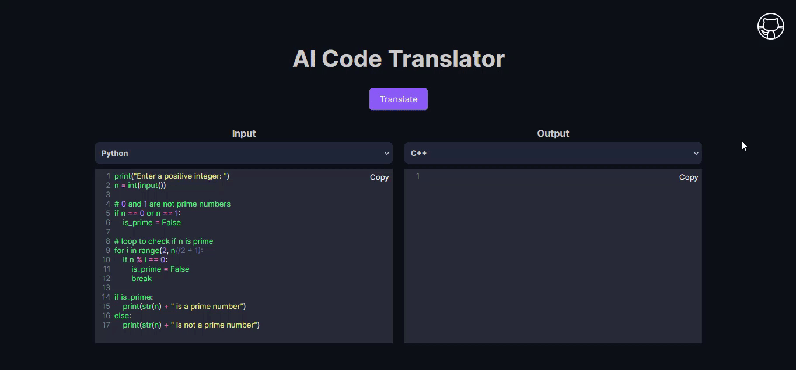

<p align="center">
  <h3 align="center">Polyglot AI</h3>
  <p align="center">
  Polyglot AI is a code translator tool for programmers, built with ChatGPT’s advanced API. It allows you to convert your code from one programming language to another with just a few clicks.
    <br/>
    <br/>
    <a href="#">Demo</a>
    .
    <a href="https://github.com/tawhidmonowar/polyglot_ai/issues">Report Bug</a>
    .
    <a href="https://github.com/tawhidmonowar/polyglot_ai/issues">Request Feature</a>
  </p>
</p>

    


## Features
- Supports multiple languages, such as Python, Java, JavaScript,and more.
- Uses ChatGPT’s natural language processing and code generation capabilities to produce high-quality translations.
- Provides a simple and intuitive user interface with syntax highlighting and code formatting.

## Installation
To use Polyglot AI, you need to have Node.js and Vite installed on your machine. You also need an OpenAI API key to access ChatGPT’s service.

1. Clone this repository or download the zip file.
```
git clone https://github.com/tawhidmonowar/polyglot_ai.git
```
2. Navigate to the project folder and run npm install to install the dependencies.
3. Create a .env file in the server directory and add your OpenAI API key as OPENAI_API_KEY= "your-key-here"
4. Run npm run dev to start the development server.

## Usage
To translate your code, follow these steps:

1. Select the source and target languages from the dropdown menus.
2. Paste or type your code in the left text area.
3. Click the “Translate” button or press Ctrl+Enter to start the translation.
4. Wait for a few seconds and see the translated code in the right text area.
5. Copy or edit the translated code as you wish.

## Contributing
Contributions are welcome! If you find any bugs or issues, please submit them in the issue tracker. If you would like to contribute code, please fork the repository and create a pull request.

## License
Polyglot AI is licensed under the MIT License. See [LICENSE](https://github.com/tawhidmonowar/polyglot_ai/blob/main/LICENSE) for more details.

## Acknowledgements
This project was built as part of my Web Programming course at [Metropolitan University](https://metrouni.edu.bd/). I would like to thank my instructor and classmates for their feedback and support. I would also like to thank OpenAI for providing ChatGPT’s API, which made this project possible.

## Author
* **Tawhid Monowar** - *Computer science student*
* **Joytun siddika** - *Computer science student*
